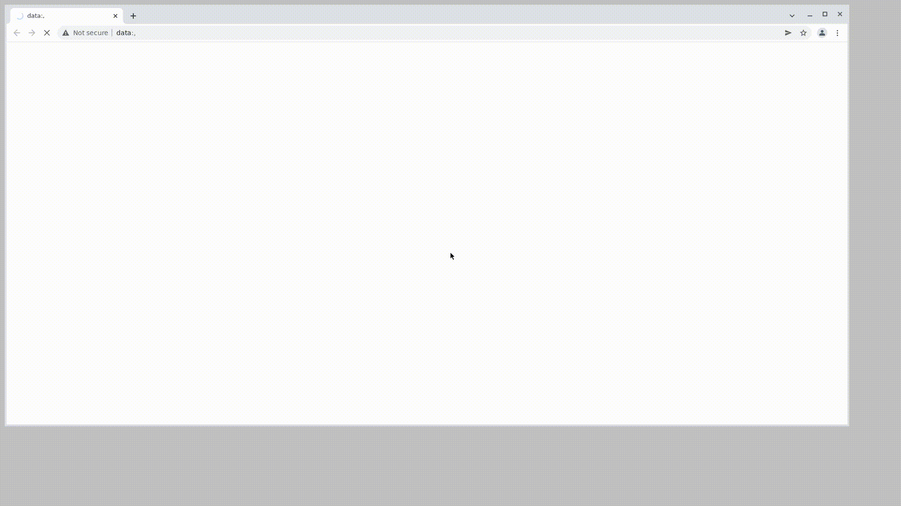

#   Автотест страницы inSales
[](https://www.insales.ru)

- __*inSales*__  — платформа управления онлайн-торговлей через сайт, на маркетплейсах, в социальных сетях и мессенджерах.


<h2>  :hammer_and_wrench: Cтек </h2>
<p align="center">
  <a href="https://www.jetbrains.com/idea/"> </a>
  <a href="https://selenide.org/"> </a>
  <a href="https://aerokube.com/selenoid/"> </a>
  <a href="https://gradle.org/"> </a>
  <a href="https://github.com/allure-framework/allure2"> </a>
  <a href="https://github.com/"></a> 
  <a href="https://telegram.org"></a>
  <a href="https://www.jenkins.io/"> </a>
  <a href="https://www.java.com/"></a>
  <a href="https://junit.org/junit5/"> </a>
</p>


## :page_with_curl: Проверки
- *Проверка кликабельности кнопки для регистрации*
- *Проверка номеров и электронной почты*
- *Проверка раздела =Проблемы, которые решает inSales=*
- *Проверка перехода по ссылке =Смотреть все шаблоны=*
- *Проверка перехода по ссылке =Смотреть все интеграции=*


##   Сборка в [Jenkins](https://jenkins.autotests.cloud/job/InSales_Test/)  :gear:
<p align="center">

 </p>

__*Сборка:*__
- `Browser` - браузер (например chrome)
- `BrowserSize` - разрешение экрана (например 1800x900)
- `BrowserVersion` - версия браузера (например 99.0)
- `TASK` - inSalesTest

## :rocket: Запуск тестов

__*Локально, из терминала:*__
```
gradle clean test
```
__*Удаленно, из терминала:*__
```
gradle clean test -DisRemote=true
```
__*Удаленно, из Jenkins:*__
```
clean
${TASK}
-DisRemote=true
-Dbrowser=${Browser}
-DbrVersion=${BrVersion}
-DbrSize=${BrSize}
-DbaseUrl=${BaseUrl}
-Dselenoid=${Selenoid}
```

### Фаил test.properties
Для запуска теста локально нужно создать фаил в папке resources (src/test/resources) и необходимо указать следующее параметры
```
selenoid_UserName = UserName
selenoid_Password = Password
selenoid_Url = Url
```
## :bar_chart: Пример отчета о прохождении тестов в Allure и Telegram


|         Allure         |  Allure |
|:-------------------------------------------------------------------------------------------:|:------------------------------------------------------------------------:|

<p align="center">
Telegram
</p>
<p align="center">
                                                                        
 </p>


###  Видео теста на Selenoid

